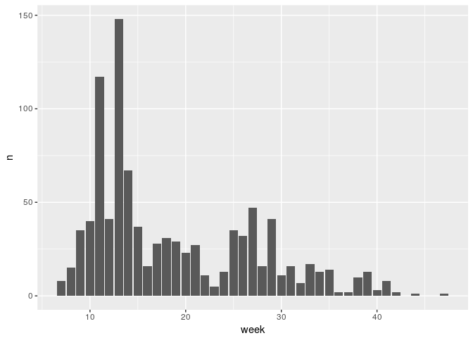

<!-- README.md is generated from README.Rmd. Please edit that file -->
[](https://ci.appveyor.com/project/EDiLD/rartenfinder) [](https://travis-ci.org/EDiLD/rartenfinder) [](https://codecov.io/github/EDiLD/rartenfinder?branch=master) [](https://cran.r-project.org/package=rartenfinder)

rartenfinder
============

R Client for the artenfinder API (<http://artenfinder.rlp.de>)

Installation
------------

### Development version from GitHub

``` r
install.packages("devtools")
devtools::install_github("EDiLD/rartenfinder")
```

``` r
library('rartenfinder')
library('dplyr')
#> 
#> Attaching package: 'dplyr'
#> The following objects are masked from 'package:stats':
#> 
#>     filter, lag
#> The following objects are masked from 'package:base':
#> 
#>     intersect, setdiff, setequal, union
```

Usage
-----

### Query metadata

#### Available taxagroups

``` r
get_taxagroups() %>%
  head()
#>   id         name_deutsch is_animal
#> 1 28 Gefäß-Sporenpflanzen     FALSE
#> 2 26          Nachtfalter      TRUE
#> 3 25              Spinnen      TRUE
#> 4 24          Zweiflügler      TRUE
#> 5 23          Netzflügler      TRUE
#> 6 22               Wanzen      TRUE
```

#### Available taxa

##### List all available taxa

``` r
get_taxa() %>%
  head() %>%
  select(-eu_guid, gid)
#> Warning in get_taxa(): Limit of 1000 reached. Not all records are returned.
#>       id  name_wissenschaftlich name_deutsch artengruppe gid is_animal
#> 1 800290     Zophodia graciella         <NA> Nachtfalter  26      TRUE
#> 2 800289 Xanthocrambus lucellus         <NA> Nachtfalter  26      TRUE
#> 3 800288       Vitula edmandsii         <NA> Nachtfalter  26      TRUE
#> 4 800287      Udea uliginosalis         <NA> Nachtfalter  26      TRUE
#> 5 800286         Udea nebulalis         <NA> Nachtfalter  26      TRUE
#> 6 800285         Udea murinalis         <NA> Nachtfalter  26      TRUE
```

##### Query taxa by regex:

``` r
get_taxa(name_regexp_ci = '^Udea.*$') %>%
  head() %>%
  select(-eu_guid, gid)
#>       id name_wissenschaftlich name_deutsch artengruppe gid is_animal
#> 1 800287     Udea uliginosalis         <NA> Nachtfalter  26      TRUE
#> 2 800286        Udea nebulalis         <NA> Nachtfalter  26      TRUE
#> 3 800285        Udea murinalis         <NA> Nachtfalter  26      TRUE
#> 4 800284     Udea inquinatalis         <NA> Nachtfalter  26      TRUE
#> 5 800283         Udea fulvalis         <NA> Nachtfalter  26      TRUE
#> 6 800282         Udea elutalis         <NA> Nachtfalter  26      TRUE
```

##### Query taxa by group

``` r
get_taxa(taxagroup = 'Flechten') %>%
  head() %>%
  select(-eu_guid, -gid)
#>       id name_wissenschaftlich       name_deutsch artengruppe is_animal
#> 1 800011       n.n. (Lichenes) unbekannte Flechte    Flechten     FALSE
#> 2 176286   Parmotrema crinitum               <NA>    Flechten     FALSE
#> 3 147261  Cladonia rangiformis               <NA>    Flechten     FALSE
#> 4 147260  Cladonia rangiferina               <NA>    Flechten     FALSE
#> 5 147253   Cladonia portentosa               <NA>    Flechten     FALSE
#> 6 147238      Cladonia humilis               <NA>    Flechten     FALSE
```

### Query observations

``` r
get_observations(scientific_name = 'milvus milvus', year = 2017) %>%
  head() %>%
  select(id, lat, lon, datum)
#>         id     lat    lon      datum
#> 1 54371700 5480733 404552 2017-11-23
#> 2 54371264 5482113 420267 2017-11-23
#> 3 54368615 5595993 409444 2017-08-12
#> 4 54368614 5595703 409038 2017-07-01
#> 5 54368613 5595600 408678 2017-09-22
#> 6 54368612 5595865 409002 2017-09-30
```

### Plotting

#### Phenogram

``` r
df <- get_observations(scientific_name = 'Gonepteryx rhamni', year = 2017)
plot_phaenogram(df, 'weekly')
```



#### Interactive map

``` r
plot_mapview(df)
```
